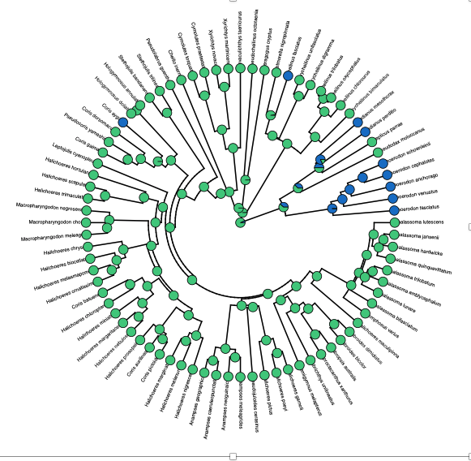
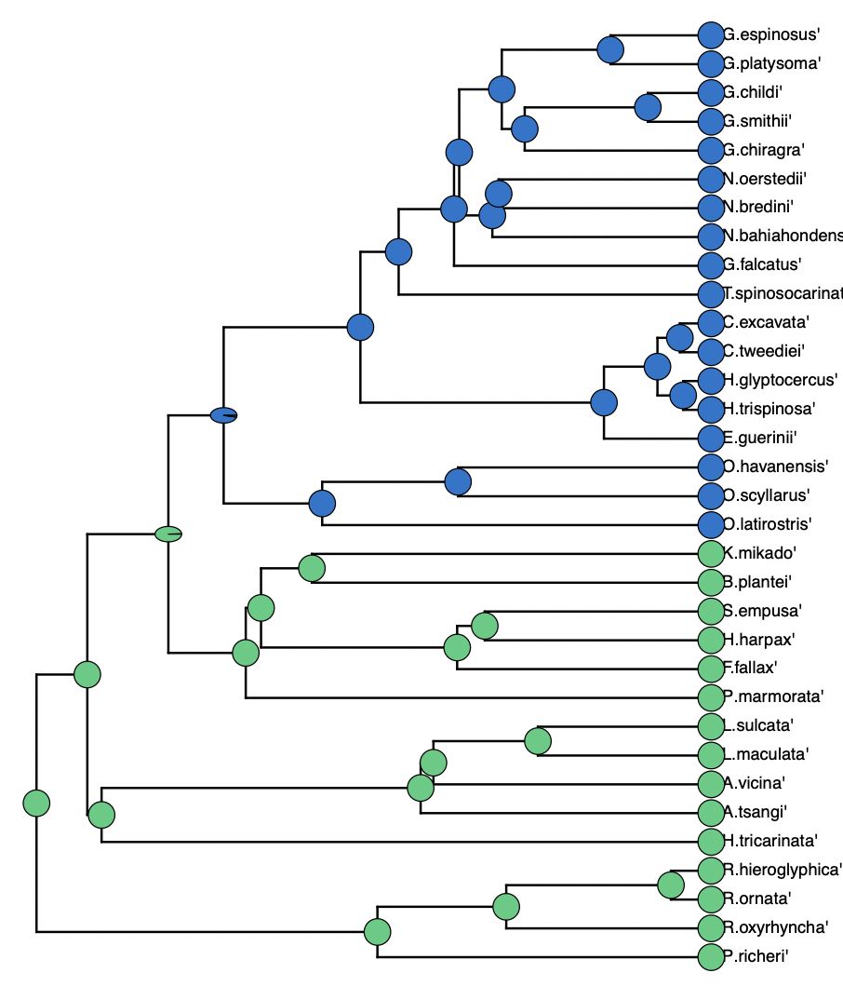
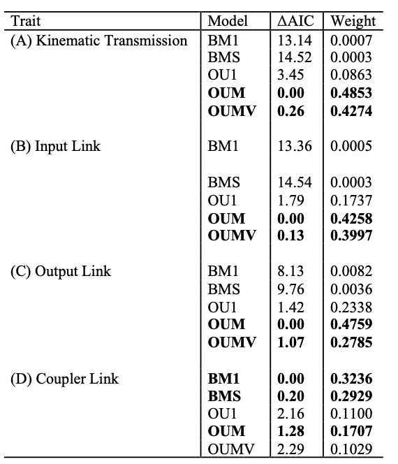
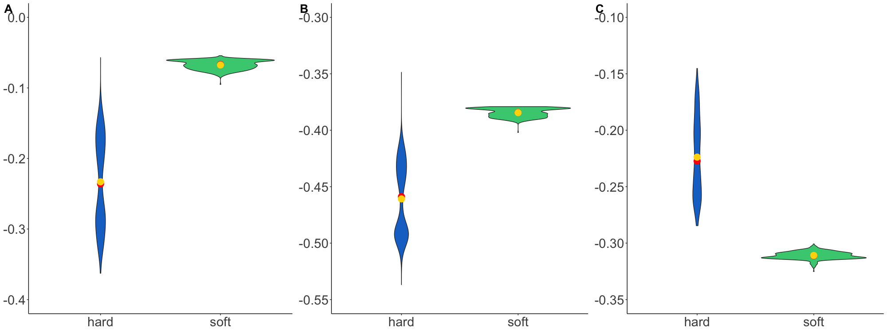
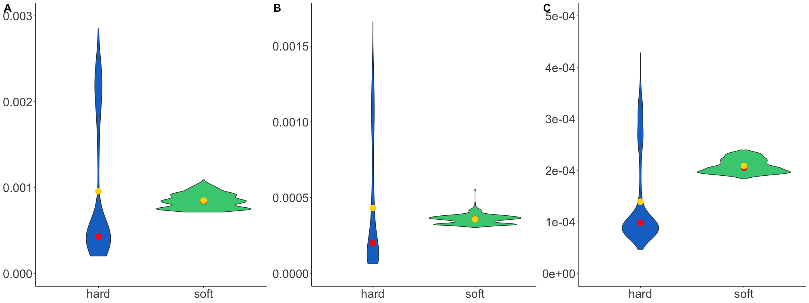
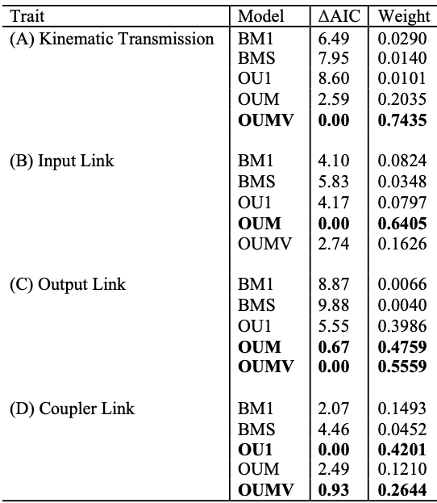
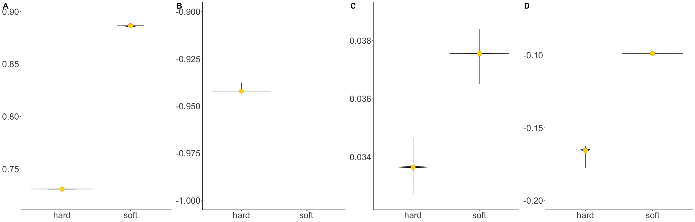
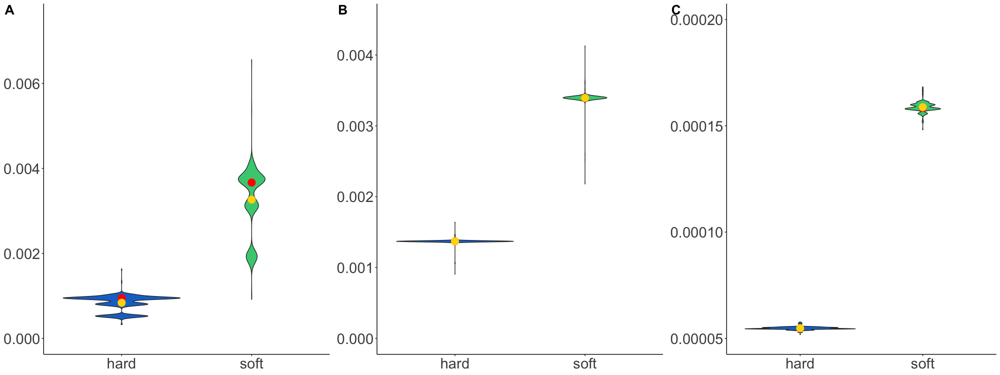

# Phylogenetic Biology - Final Project

## Introduction and Goals

One major question in evolutionary biology is understanding how tempo and mode of evolution proceeds throughout the tree of life (Simpson 1944). Differences in selective pressures or access to different environmental resources can influence the pace of evolution for all traits such as morphology. Morphological traits can be used to understand biomechanical functions important for organismal fitness (Arnold 1983; Arnold 1992). 

Four-bar linkages have independently evolved multiple times in nature and are used to assist with a variety of locomotor functions. These four links consist of an immovable link (the fixed link) and three mobile links (input, output, and coupler). In combination, these links function to transmit force and motion. Mechanical output of these strikes can be characterized by kinematic transmission (KT) which is a ratio of angular output motion relative to angular input motion. KT can be used to characterize a tradeoff seen in four-bar linkages between force and displacement, which is observed in both wrasses and mantis shrimp. High KT values are associated with displacement modified feeding. In mantis shrimp, species with higher KT values have a more ‘spearlike’ raptorial appendage useful for harpooning elusive prey. Wrasses with higher KT values are seen to feed more on elusive prey such as zooplankton and fish. Lower KT values are associated with more force-modified feeding. For mantis shrimp, species with lower KT values have raptorial appendages with a morphology more useful for smashing. Wrasses with lower KT values usually feed on more sessile prey. 

The goal for this project was to see how diets specialized for feeding on hard prey vs fast prey has resulted in differences on the evolutionary rate(σ2) or strength of selection (α) for the four-bar linkage system .I used previously published data for four-bar linkage systems in wrasses and mantis shrimp. Data for the oral four-bar linkage system in wrasses (Family: Labridae) was from Alfaro et al. (2004). Data for the raptorial four-bar linkage system in mantis shrimp (Order: Stomatopoda) was from from Anderson and Patek (2015). Diet classification for the wrasses was based on Price et al. (2011). Whether was wrasse  molluscivorous or not determined if it was durophagous. Mantis shrimp diet was classified as durophagous for the smashing species and non-durophagous for the spearing species. Species were assigned to one of two evolutionary regimes (durophagous for diets where being force-modified would be important and non-durophagous for diets where being velocity-modified would be important). 

## Methods

I fitted different evolutionary models of evolution on each link of the four-bar system and using the R package OUwie (Beaulieu et al. 2012). OUwie determines the best fit between different Brownian motion (BM) and Ornstein-Uhlenbeck (OU) models of trait evolution. Differences between models rely on variation between different parameters important for trait evolution: σ2,  is the rate of stochastic character evolution, θ is the evolutionary optimal trait value, and α is the strength of selection on a given optimum. I fitted 6  different evolutionary models (2 BM and 4 OU) in OUwie. BM1 is the simplest model and is a single-rate (σ2) model in which all species have the same σ2. BMS is a two-rate model that has different evolutionary rates between regimes (durophagous vs non-durophagous). OU1 is the simplest OU model and fits a single trait optimum (θ) for the entire clade. OUM model fits separate θ between durophagous and non-durophagous species. OUMV fits separate θ and σ2, between regimes. OUMVA fits separate θ,σ2,and strength of selection (α) between regimes. After fitting each model separately for each morphological trait, used sample size corrected AICc scores to compare the best fitting evolutionary models for each trait. 
Due to lack of statistical power, complex OU models can often be incorrectly favored (Cooper et al 2016; Ho and Ané 2014). To confirm there was enough statistical power to accurately compare between models (especially the more complex models), I simulated data for  using the function OUwie.sim in the R package OUwie according to parameters associated with each model. Simulated data was then be fitted through all six models in OUwie to determine if data under which parameters were simulated is returned as the best fitting model.  

Figure 1: Wrasse phylogeny indicating differences between durophagous species (blue) and nondurophagous species (green).

Figure 2: Mantis shrimp phylogeny indicating differences between durophagous species (blue) and nondurophagous species (green).

## Results

*Testing for effect of diet on four-bar linkage evolution in wrasses*

The best-supported models for evolution of overall kinematic transmission (KT) was best represented by a two-peak OU model with strong support between single-rate and two-rate models (OUM & OUMV; Table 1A). Non-durophagous species had a higher peak and an evolutionary rate about twice as fast as durophagous species (Figure 3A & 4A respectively). For the input link, the best-supported models also indicated a two-peak OU model with equal support for single-rate and two-rate models (OUM & OUMV; Table 1B). Phenotypic optima were higher in non-durophagous species when compared to durophagous species with durophagous species having an overall slower evolutionary rate than non-durophagous species (Figure 3B & 4B respectively). Output link evolution was characterized by an OU-like process, but there was equal support among one-peak, and two-peak OU models, and single- and multi-rate models (OU1, OUM, & OUMV; Table 1C). When comparing differences in phenotypic optima from two-peak models, durophagous species had a higher optima than non-durophagous species (Figure 1C). When comparing differences in rate in the two-rate model, durophagous species displayed a slower rate for output link (Figure 4C). The best supported model for the coupler link was a single-rate BM model (BM1; Table 1D).  

Table 1: Table of evolutionary model selection for wrasses for KT and all four-bar linkages

Figure 3: Differences in phenotypic optima (θ) between durophagous and nondurophagous species for traits that had support for a two-peak model in wrasses. (A) Kinematic Transmission (B) Input Link (C) Output Link

Figure 4: Differences in evolutionary rate (σ2) between durophagous and nondurophagous species for traits that had support for a two-rate model in wrasses. (A) Kinematic Transmission (B) Input Link (C) Output Link

*Testing for effect of diet on four-bar linkages in mantis shrimp*

The best-supported model for overall KT was a two-rate, two-peak OU model (OUMV; Table 2). Durophagous species displayed a slower evolutionary rate and lower phenotypic optima when compared with non-durophagous species for KT (Figure 5A and 6A respectively). The best-supported model for the input link was a two-peak single rate model (OUM; Table 2). Non-durophagous species had a higher peak than durophagous species (Figure 5D). For the output link, the best-supported model indicated a two-rate, two-peak OU model (OUMV; Table 2). Durophagous species had a higher phenotypic optima and slower evolutionary rate than non-durophagous species (Figure 5B and 6B respectively). For the coupler link there was equal support for a single peak OU model and a two-peak two-rate model (OU1 & OUMV; Table 2). When comparing differences in the two-rate two peak model for the coupler link, durophagous species had a lower optima and a slower evolutionary rate than non-durophagous species (Figure 5C and 6C respectively). 

Table 2: Table of evolutionary model selection for mantis shrimp for KT and all four-bar linkages

Figure 5: Differences in phenotypic optima (θ) between durophagous and nondurophagous species for traits that had support for a two-peak model in mantis shrimp. (A) Kinematic Transmission (B) Output Link (C) Coupler Link (D) Input Link

Figure 6: Differences in evolutionary rate (σ2) between durophagous and nondurophagous species for traits that had support for a two-rate model in mantis shrimp. (A) Kinematic Transmission (B) Output Link (C) Coupler Link

## Discussion

A general feature of biological systems is unequal rates of evolution. The goal of these analyses was to understand how different dietary demands can influence uneven rates of evolution.The best supporting models of evolution for both systems were two-peak models with strong support for a two-rate model. Comparison of evolutionary parameters suggest that shifts to force-based feeding repeatedly resulted in a slowdown of the evolutionary rate for the biomechanical output (KT) and individual links that comprise the four-bar system in wrasses and mantis shrimp. For wrasses, there was support for the input and output link to evolve on different optima between durophagy and nondurophag. This was expected since these two links are the most mechanically sensitive in wrasses (Muñoz et al 2018). Surprisingly, in mantis shrimp there was also some support for two-rate, two-peak model of evolution for the coupler link. However, one particular limitation with the mantis shrimp is the taxa size (n=34). Model selection with simulated data indicated lack of statistical power for a two-rate, two-peak, two-alpha model (OUMVA) so it was rejected from the model selection. However, the two-rate, two-peak model is still relatively complex and may still be have been incorrectly favored. Therefore, findings for mantis shrimp data might need additional data to support the general findings. 

The biggest difficulty in implementing these analyses was learning how to use the R package OUwie (Beaulieu et al 2012). After completing my analyses, there was also difficulty in interpreting my results and trusting what they meant. However, working through this package and my analyses helped be learn the value in simulations, understand what evolutionary parameters actually mean/how they work, and understand Orstein-Uhlenbeck models better.  

If I did these analyses again I would collect more data for both wrassses and mantis shrimp. For these analyses I used previously published datasets. To have stronger support for mantis shrimp, I would collect more four-bar linkage data for to increase the number of species. I would also try and have a more specific diet categorizations for both wrasses and mantis shrimp. One potential limitation was how I classified species as "durophagous" or "nondurophagous". For wrasses, species classified as "molluscivores" were the ones considered durophagous. However, there are other "hard" prey items besides molluscs! Collecting more specific diet data could change which species were assigned to which peaks (and potentially alter results). For mantis shrimp, I classified species as durophagous/non-durophagous based on if they were considered "smashers" or "spearers". However, like wrasses mantis shrimp are not limited to eating just one thing. More specific diet data for wrasses could potentially reassign species to different peaks. 

## References

Alfaro ME, Bolnick DI, Wainwright PC. 2004. Evolutionary dynamics of complex biomechanical systems: an example using the four-bar mechanism. Evolution 58:495–503 .

Anderson PSL, Patek SN. 2015. Mechanical sensitivity reveals evolutionary dynamics of mechanical systems. Proceedings of the Royal Society B: Biological Sciences 282:20143088.

Arnold SJ. 1983. Morphology, performance and fitness. American Zoologist 23:347–361. 

Arnold SJ. 1992. Constraints on phenotypic evolution. The American Naturalist 140:S85–S107

Beaulieu J.M., Jhwueng D.C., Boettiger C., O’Meara B.C. 2012. Modeling stabilizing selection:
Expanding the Ornstein-Uhlenbeck model of adaptive evolution. Evolution. 66:2369–2383

Cooper N., Thomas G.H., Venditti C., Meade A., Freckleton R.P. 2016. A cautionary note on the
use of Ornstein Uhlenbeck models in macroevolutionary studies. Biol. J. Linn. Soc. 118:64–77.
Ho L.S.T., An. C. 2014. Intrinsic inference difficulties for trait evolution with Ornstein-Uhlenbeck models. Methods Ecol. Evol. 5:1133-1146.

Munoz M.M., Hu Y., Anderson P.S.L., Patek S.N. 2018. Strongbiomechanical relationships bias the tempo and mode of morphological evolution. eLife 7:e37621.

Price, S. A., Holzman, R., Near, T. J., & Wainwright, P. C. (2011). Coral reefs promote the evolution of morphological diversity and ecological novelty in labrid fishes. Ecology Letters, 14, 462– 469.

Simpson GG. 1944. Tempo and Mode in Evolution. Columbia University Press.

